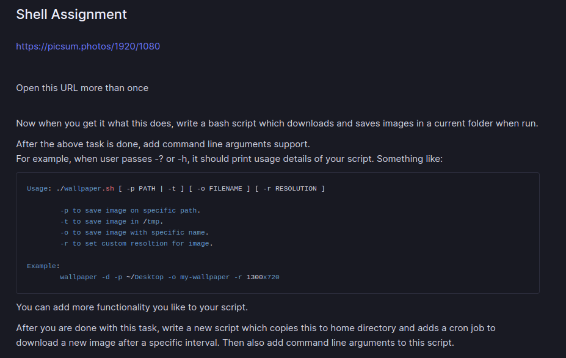

# Bash_Assignment

This Assignment has Two Parts i.e:

- It is a bash script which downloads and saves images in a current folder when run.
- Write a script which copies previous script to home directory and adds a cron job to download a new image after a specific interval.

## Assignment

## Example

Hit Below Link more then Once

- [Live Example](https://picsum.photos/1920/1080)
